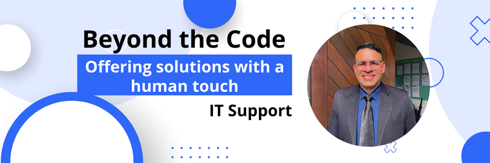
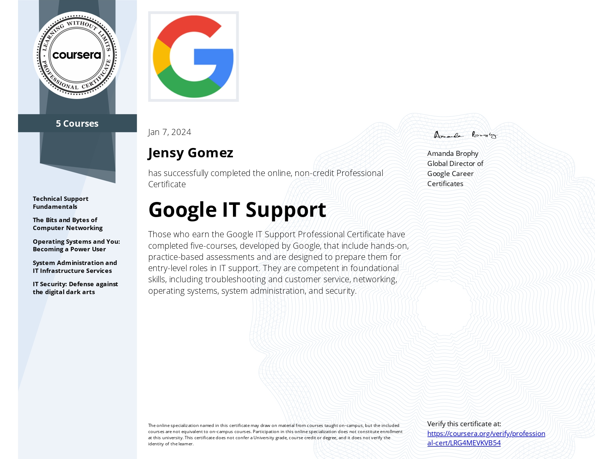

<!-- Number of Visitors to my GitHub -->

<!-- Welcome to my Readme.md -->
<h1 align="center">
    
</h1>

<!-- Main and Centralized Banner -->

  

<!-- My social networks -->

 
  
  
 

<!-- Development tool (IDE)-->
 
<h1>Tools I use in my workplace.</h1>

  
  
  
  
  
  
  
  
  
  
  
  
  
  

  

 

 <!-- My skills -->
 
<h1>Operating Systems</h1>

  
  
  
  
  
  
  
  

  

 

<!-- My status -->

 
    

## My *Learnings*
<table>
<tr>
<td width="50%">
<h3 align="center">Google IT Support Professional Certificate</h3>

  

It has been a pleasure to have completed this spectacular specialization as a Support Analyst in the IT field

                                                                              

<td width="50%">
<h3 align="center">Information Technology Management</h3>

  

In this year 2024, I am starting my fourth semester in the field of Technology.

                                                           
</table>                                                                                 

 

          

